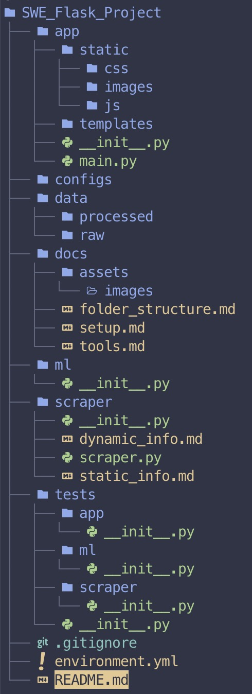

# Folder Structure

## Overview

Below is the folder structure for the SWE Flask project. The project is divided into several components, each with its own directory. The main components are the Flask application, data, documentation, machine learning models, web scraping, configuration files, and tests. The structure is designed to be modular and scalable, allowing for easy integration of new features and components.



## Description

```plaintext
SWE_Flask_Project/
│
├── app/ - Contains the Flask application and its components.
│   ├── static/ - Houses static files like CSS, JavaScript, and images.
│   │   ├── css/ - CSS files for styling the web application.
│   │   ├── js/ - JavaScript files for front-end functionality.
│   │   └── images/ - Image files used within the application.
│   │
│   ├── templates/ - Templates for rendering HTML.
│   │
│   ├── __init__.py - Initialises the Flask application.
│   └── main.py - The entry point for the Flask application.
│
├── data/ - Contains data related to Dublin Bike stations.
│   ├── raw/ - Raw data collected from various sources.
│   └── processed/ - Data that has been cleaned, transformed, and is ready for use.
│
├── docs/ - Documentation for the project.
│   ├── assets/ - Images and other assets used in the documentation.
│       └── images/ - Image files used in the documentation.
│   │
│   ├── folder_structure.md - Overview of the folder structure.
│   ├── tools.md - Tools used in the project and their purpose.
│   └── setup.md - Instructions for setting up the project.
│
├── ml/ - Machine learning models for predicting bike station occupancy.
│   ├── __init__.py
│   ├── model.py - Defines the ML model structure and parameters.
│   ├── train.py - Scripts to train the ML models.
│   └── predict.py - Uses trained models to make predictions based on input data.
│
├── scraper/ - Web scraping scripts to collect dynamic and static data.
│   ├── __init__.py
│   ├── dynamic_info.md - Documentation on dynamic data sources.
│   ├── static_info.md - Documentation on static data sources.
│   └── scraper.py - Implementation of web scraping functionality.
│
├── configs/ - Configuration files for the components of the application.
│
├── tests/ - Test suite for the application, including unit and integration tests.
│   ├── app/ - Tests related to the Flask application.
│   ├── ml/ - Tests for the machine learning model functionality.
│   └── scraper/ - Tests for the web scraping components.
│
├── .gitignore - Specifies intentionally untracked files to ignore.
├── README.md - Project overview.
└── environment.yml - Specifies the Conda environment and dependencies.
```
